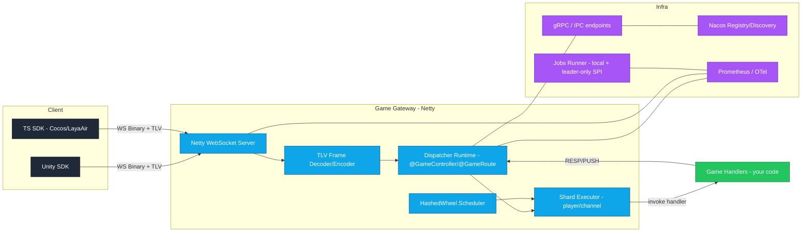

# CivGenesis

[](https://github.com/cuihairu/civgenesis/actions/workflows/ci.yml)
[](https://github.com/cuihairu/civgenesis/actions/workflows/docs.yml)
[](https://codecov.io/gh/cuihairu/civgenesis)


[](LICENSE)

Java 21 / Spring Boot / Netty game server framework for building real-time game backends with a custom WS binary protocol, annotation-based routing, sharded execution, reliable push/resume, observability, and service discovery.

This repository contains framework/runtime code only (no gameplay/business logic).

License: Apache-2.0 (see `LICENSE`).

## Why CivGenesis

- Netty-only message pipeline (no Spring MVC/Tomcat in the hot path)
- Custom protocol: WebSocket Binary + TLV envelope (extensible, skip-unknown) + Protobuf payload
- Req/Resp with dedup-friendly `seq`, plus reliable push with `ACK_REQUIRED` + resume window
- Sharded execution model for game state (by `playerId` / channel)
- Optional Prometheus metrics + OpenTelemetry tracing
- Nacos-based service discovery + gRPC/IPC integration points

## Architecture



## Repo layout

```
.
├── civgenesis-core/                 # protocol, errors, sharded executors, observability SPI
├── civgenesis-codec-tlv/            # TLV varint codec
├── civgenesis-protocol-system/      # system.proto (reserved msgId range)
├── civgenesis-codec-protobuf/       # protobuf payload codec + system Error
├── civgenesis-dispatcher/           # @GameController/@GameRoute + route scan + dispatcher runtime
├── civgenesis-scheduler/            # hashed wheel scheduler (time wheel)
├── civgenesis-transport-netty-ws/   # Netty WebSocket transport
├── civgenesis-registry/             # registry/discovery SPI
├── civgenesis-registry-nacos/       # Nacos implementation
├── civgenesis-rpc-grpc/             # gRPC helpers
├── civgenesis-jobs/                 # background jobs (local + leader-only lease SPI)
├── civgenesis-spring-boot-starter/  # auto-wiring (no MVC), properties, lifecycle
├── clients/
│   ├── unity/                       # Unity (C#) client SDK (protocol + connection mgmt)
│   └── ts/                          # TypeScript client SDK (Cocos/LayaAir)
└── docs/                            # VuePress docs (published via GitHub Pages)
```

## Design principles (high-level)

- Keep the hot path minimal: Netty -> decode -> dispatch -> shard -> handler
- Prefer deterministic state handling: shard by `playerId` for ordered execution
- Treat reliability as a protocol feature: `seq` for Req/Resp retries; `pushId` + `ACK_REQUIRED` for reliable push
- Prefer “resume window, else full sync”: small gap replay, large gap snapshot
- Observability is opt-in but first-class: metrics & tracing should be cheap when disabled

## Quick start (server)

Spring Boot is used for wiring/lifecycle only. Game messages do not go through Spring MVC.

1) Add dependency (your app)

```kotlin
dependencies {
  implementation("io.github.cuihairu:civgenesis-spring-boot-starter:<version>")
}
```

2) Write routes

```java
@GameController
public class EchoController {
  @GameRoute(id = 1000, open = true)
  public void echo(RequestContext ctx, EchoReq req) {
    ctx.reply(EchoResp.newBuilder().setText(req.getText()).build());
  }
}
```

3) Provide system integrations (required)

- Implement token authentication for `Resume`:
  - SPI: `io.github.cuihairu.civgenesis.system.auth.TokenAuthenticator`
- Implement snapshot generation for `SyncSnapshot` (recommended):
  - SPI: `io.github.cuihairu.civgenesis.system.snapshot.SnapshotProvider`

4) Configure

```yaml
civgenesis:
  dispatcher:
    enabled: true
    shards: 64
  ws:
    enabled: true
    port: 8080
    path: /ws
```

## Docs

- Docs index: `docs/README.md`
- GitHub Pages (CI published): `https://cuihairu.github.io/civgenesis/`
- Protocol: `docs/PROTOCOL.md`
- Protobuf workflow: `docs/PROTOBUF.md`
- Dispatcher/routing: `docs/DISPATCHER.md`
- Observability: `docs/OBSERVABILITY.md`
- Jobs (local/distributed): `docs/JOBS.md`
- Client SDKs: `docs/CLIENT_SDK.md`

## Client SDKs (protocol only)

- Unity（C#）：`clients/unity/`
- TypeScript（Cocos/LayaAir）：`clients/ts/`

## Build

```bash
./gradlew build
```

## Docs site (VuePress)

Local preview:

```bash
npm ci
npm run docs:dev
```

Build static site:

```bash
npm ci
npm run docs:build
```
